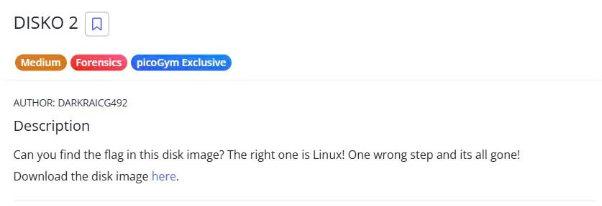
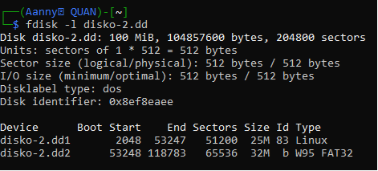
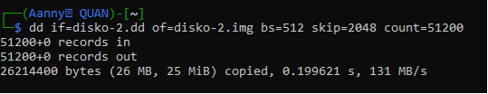
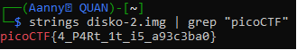

#DISKO\_2

Download the file by wget in linux or normal download is fine🐧

Ok! Now we can use fdisk to list available partitions.

As we can see, it has two partitions disko-2.dd1 and disko-2.dd2. Let’s check the first one.

Hint: How can you extract/isolate a partition?

Therefore, we focus on Linux partition, extract the partition into an .img format, by these commands

Now we can use strings to find the flag

The Flag: picoCTF{4\_P4Rt\_1t\_i5\_a93c3ba0}
