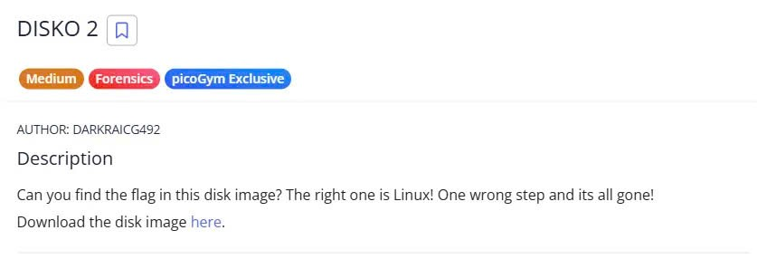
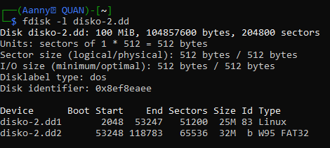

#DISKO_2

{width="6.270138888888889in"
height="2.142361111111111in"}

Download the file by wget in linux or normal download is fine

Ok! Now we can use fdisk to list available partitions.

{width="4.896516841644795in"
height="2.2086417322834646in"}

As we can see, it has two partitions disko-2.dd1 and disko-2.dd2. Let's
check the first one.

Hint: How can you extract/isolate a partition?

Therefore, we focus on Linux partition, extract the partition into an
.img format, by these commands

{width="5.604948600174978in"
height="1.0730664916885388in"}

Now we can use strings to find the flag{width="3.4171434820647417in"
height="0.5729965004374453in"}

The Flag: picoCTF{4_P4Rt_1t_i5_a93c3ba0}
